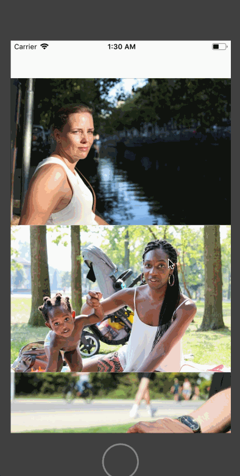

# Tumblr-Feed

**Tumblr** is a photo browsing app using the [The Tumblr API](https://www.tumblr.com/docs/en/api/v2#posts).

# Add this to top of exsiting Tumblr README
# Lab 2 - *Tumblr-Details Screen*

**Tumblr** is a photo browsing app app using the [The Tumblr API](https://www.tumblr.com/docs/en/api/v2#posts).

Time spent: **x** hours spent in total

## User Stories

The following **required** user stories are complete:

- [x] User can tab an image to view a larger image in a detail view (5pts)

The following **stretch** user stories are implemented:

- [ ] Add Avatar and Publish Dates (+2pt)
- [ ] Zoomable Photo View (+2pt)
- [ ] Infinite Scrolling (+2pt)

The following **additional** user stories are implemented:

- [x] List anything else that you can get done to improve the app functionality! (+1-3pts)
To improve the app's functionality a search bar or a way to filter results from different tumblr accounts could be implemented. A sign in option to view your own tumblr feed would also greatly improve the functionality of the app.

Please list two areas of the assignment you'd like to **discuss further with your peers** during the next class (examples include better ways to implement something, how to extend your app in certain ways, etc):
I would like to discuss the api calls further with my peers as well as how to pass values between screens. Although I was able to complete the assignment, this is where I struggled the most.

## Video Walkthrough

Here's a walkthrough of implemented user stories:

GIF created with [LiceCap](http://www.cockos.com/licecap/).

## Notes

Updating the date label

## License

Copyright [2019] [YOUR NAME]

Licensed under the Apache License, Version 2.0 (the "License");
you may not use this file except in compliance with the License.
You may obtain a copy of the License at

http://www.apache.org/licenses/LICENSE-2.0

Unless required by applicable law or agreed to in writing, software
distributed under the License is distributed on an "AS IS" BASIS,
WITHOUT WARRANTIES OR CONDITIONS OF ANY KIND, either express or implied.
See the License for the specific language governing permissions and
limitations under the License.

##Tumblr Part 1

## User Stories

The following **required** user stories are complete:

- [x] User can scroll through a feed of images returned from the Tumblr API (5pts)

The following **stretch** user stories are implemented:

- [ ] User sees an alert when there's a networking error (+1pt)
- [ ] While poster is being fetched, user see's a placeholder image (+1pt)
- [ ] User sees image transition for images coming from network, not when it is loaded from cache (+1pt)
- [ ] Customize the selection effect of the cell (+1pt)

The following **additional** user stories are implemented:

- [ ] List anything else that you can get done to improve the app functionality! (+1-3pts)
-[] Pull to refresh implemented
-[]Activity indicator implemented while images are being retrieved

Please list two areas of the assignment you'd like to **discuss further with your peers** during the next class (examples include better ways to implement something, how to extend your app in certain ways, etc): Next class I would like to talk about adding different menus or a search to the app, so that the entire app is not just pulling pictures from someone's Tumblr account.

## Video Walkthrough

Here's a walkthrough of implemented user stories:

## Notes

-I had a hard time figuring out how to resize the table cells.

## License

Copyright [2019] [Aaron Parks]

Licensed under the Apache License, Version 2.0 (the "License");
you may not use this file except in compliance with the License.
You may obtain a copy of the License at

http://www.apache.org/licenses/LICENSE-2.0

Unless required by applicable law or agreed to in writing, software
distributed under the License is distributed on an "AS IS" BASIS,
WITHOUT WARRANTIES OR CONDITIONS OF ANY KIND, either express or implied.
See the License for the specific language governing permissions and
limitations under the License.